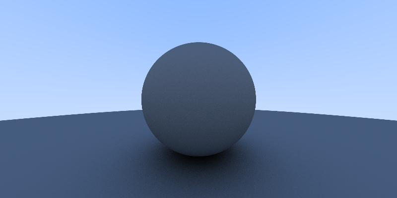

# ReasonML RayTracer

This project represents my first attempt in learning reasonml and writing a raytracer that uses bouncing rays. It was done both as a learning exercise for myself and as a showcase of my programming skills for **Coursebase**.

Basically a collection of rays from a single point are extruded in a pyramid shape. A 2D grid intersects this pyramid
of rays where each grid square represents a pixel in a picture and each ray that intersects a pixel represents a ray of light.

The color of each pixel is determined by whether or not a ray that intersects the pixel also intersects with an object or the
background color.


I've had experience writing a ray tracer before but this was my first attempt at writing a raytacer that simulates bouncing light. The simplest ray tracer usually just approximates light using a simple equation called Phong to calculate the color of an object based off the angle between a surface normal and point source of light.

This ray tracer is a bit more advanced as it simulates real light using a recursive ray bouncing algorithm. The light source is also more complex as it is no longer a point light source but the entire sky serves as a source of light. Every point on an object has rays of light from two main sources: rays of light from the sky and rays of light bouncing off other objects.

The ray tracer samples a random set of these rays hitting this point and averages the color to determine the best color to be drawn on the pixel. To generate the shading in the picture the more times a ray has bounced the darker the color. This results in shadows and shading that are very realistic as it simulates how real ambient light works.

The ray tracer is actually a monte carlo simulation that uses randomness to simulate light. The randomness can produce artifacts that appear as graininess in the picture... the way to reduce graininess is to increase the sample size of random rays but that comes at the cost of rendering time.

The picture included in the repo: 800x400.ppm took 4 hours to render with 200 random ray samples per pixel. Part of the slowness is due to the fact that there is no parrelism and node is too slow to run such algorithms. It's more of a learning exercise if anything. The result is shown below:



# Running:

current settings in the file will take 10 minutes to render the same picture in the repo at 200x100 pixels with 100 random ray samples per pixel.

You can view the included picture by opening 800x400.ppm file in your favorite picture viewer. Some applications can't view the ppm but the mac previewer should work. If you can't view the ppm file I've included a 800x400.png file that's more compatible with all viewers.

```bash
node src/Main.bs.js > picture.ppm
```

# Build:

```bash
yarn build
```
